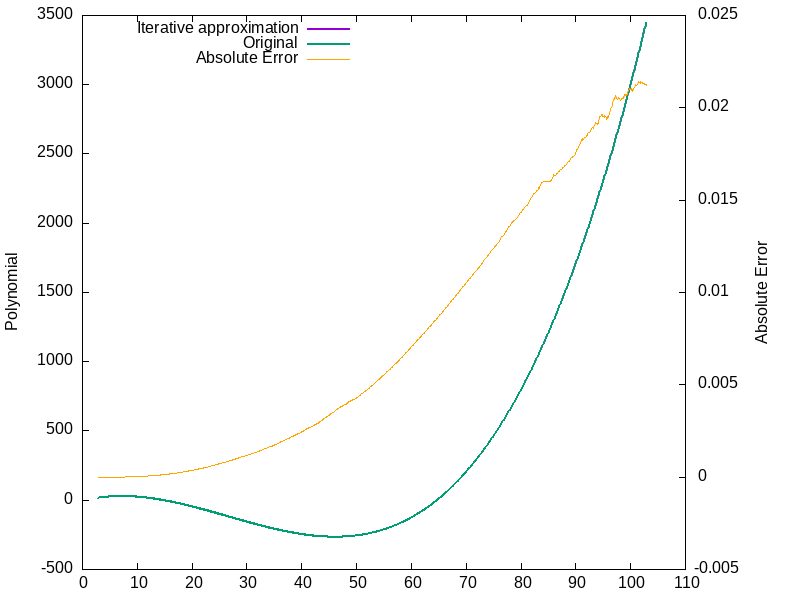

# Polynomial sampler using only additions

Calculate polynomials iteratively using only addition operations and fixed
memory. Essentially Babbage's difference engine algorithm (Rediscovered by the
authors over a coffee at CCC 2023).

The initial register values have to be calculated given the original polynomial,
after that next values are calculated just updating N+1 (N=degree of Polynomial)
registers. The resolution of these registers can be chosen to fit the accuracy
requirements and memory constraints.

## Implementation C++

Proof-of-concept in `iterative-polynomial-sampler.cc`.

It is done as self-compiling C++ script for ease of use:

```
./iterative-polynomial-sampler.cc > poly.data
```

Use `gnuplot` to visualize the output and error:

```
./iterative-polynomial-sampler.cc > poly.data && gnuplot plot-poly.gp
```



## Implementation in XLS

TBD
