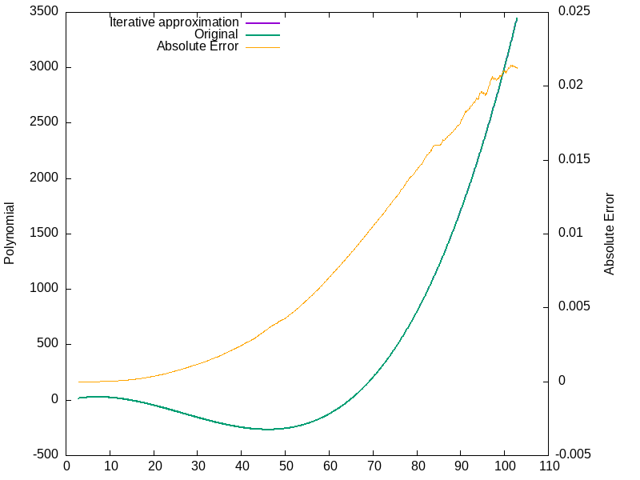

# Polynomial sampler using only additions

Calculate polynomials iteratively using only addition operations and fixed
memory. Essentially Babbage's difference engine algorithm (Rederived by the
authors over a coffee at CCC 2023).

The initial register values have to be calculated given the original polynomial,
after that next values are calculated just updating N+1 (N=degree of Polynomial)
registers. The resolution of these registers can be chosen to fit the accuracy
requirements and memory constraints.

This [short paper](docs/difference-engine.pdf) describes the idea.

## Implementation in C++

Proof-of-concept in `iterative-polynomial-sampler.cc`.

It is done as self-compiling C++ script for ease of use:

```
./iterative-polynomial-sampler.cc > poly.data
```

Use `gnuplot` to visualize the output and error:

```
./iterative-polynomial-sampler.cc > poly.data && ./plot-poly.gp
```



## Implementation in Rust

Essentially a transcript of the c++ code to Rust, including a similar
script-like self-compile (thanks [Gemini](https://gemini.google.com)):


```
./iterative-polynomial-sampler.rs > poly.data && ./plot-poly.gp
```

## Implementation in XLS

There is an implementation as a XLS proc in `iterative_polynomial_sampler.x`

```Rust
proc IterativePolynomialSampler<T: type, DEGREE: u32> { ... }
```

Also the XLS implementation allows to directly execute the test by calling
the exuctable file (should use nixos to pull the xls binaries. See Makefile
for details how the test is executed).

The XLS implementation test uses the same initialization values as the `*.cc`
and `*.rs` implementation, so the output sequence is the same.

```
./iterative_polynomial_sampler.x
[ RUN UNITTEST  ] SamplerTest
I0905 12:43:47.065955   55909 iterative_polynomial_sampler.x:150] start: sending request
I0905 12:43:47.066044   55909 iterative_polynomial_sampler.x:183] 0 16.07000
I0905 12:43:47.066094   55909 iterative_polynomial_sampler.x:183] 1 16.60991
I0905 12:43:47.066135   55909 iterative_polynomial_sampler.x:183] 2 17.13568
I0905 12:43:47.066176   55909 iterative_polynomial_sampler.x:183] 3 17.64737
I0905 12:43:47.066215   55909 iterative_polynomial_sampler.x:183] 4 18.14504
I0905 12:43:47.066253   55909 iterative_polynomial_sampler.x:183] 5 18.62875
I0905 12:43:47.066292   55909 iterative_polynomial_sampler.x:183] 6 19.09856
I0905 12:43:47.066329   55909 iterative_polynomial_sampler.x:183] 7 19.55453
...
[            OK ]
[===============] 1 test(s) ran; 0 failed; 0 skipped.
```
